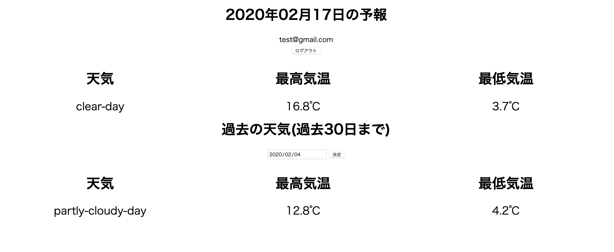

# 天気予報取得アプリ

東京の明日の天気予報と、過去30日の実際の気象データを取得することができます。
具体的には「天候」,「最高気温」,「最低気温」を表示します。



ForecastGetterはサーバー側のコードが入っているフォルダ、Frontはフロント側のコードが入っているフォルダです。

## バージョン
* ruby 2.6.0

## 起動方法
### サーバ側

```
$ git clone git@github.com:zoi-aoba/weather-forecast-api-20200130.git
$ cd weather-forecast-api-20200130
$ cd ForecastGetter
$ bundle install
$ rails db:create
$ rails db:migrate
$ rails s
```

### フロント側
ブラウザで`Front/index.html`を開きます。そうすると、新規登録ページが開きますので、そこからユーザー登録を行います。